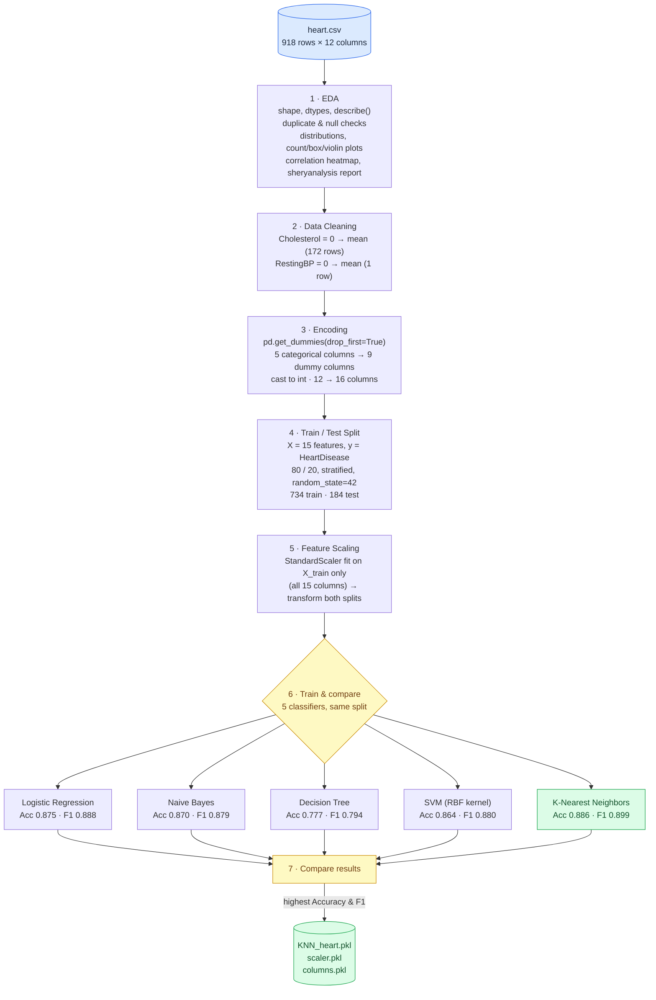
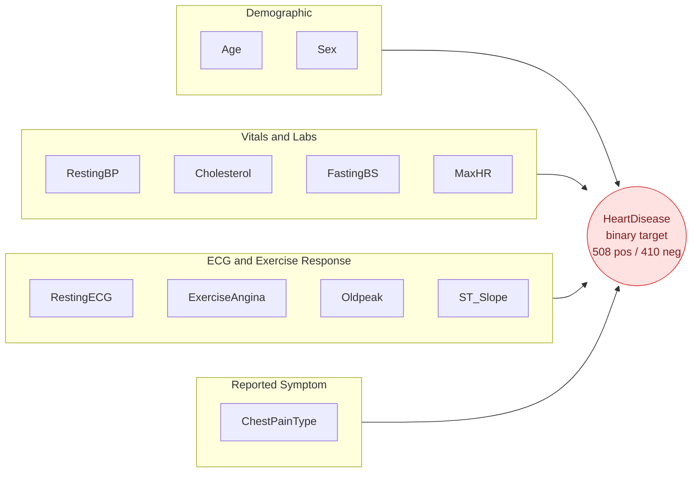
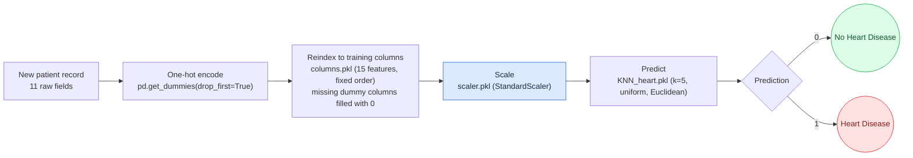

# 🫀 Heart Disease Risk Prediction

*Repository: `heart-disease-model`*

An end-to-end machine learning pipeline built on the **Heart Failure Prediction Dataset**: exploratory analysis, data cleaning, one-hot encoding, a leak-free train/test split, feature scaling, training and comparing five classifiers, and shipping the best-performing model (a K-Nearest Neighbors classifier) as a ready-to-load `.pkl` artifact.


## Table of Contents
- [Overview](#overview)
- [Repository Structure](#repository-structure)
- [Dataset](#dataset)
- [Pipeline Diagram](#pipeline-diagram)
- [Feature Overview Diagram](#feature-overview-diagram)
- [Model Comparison & Selection](#model-comparison--selection)
- [Saved Artifacts & Inference Diagram](#saved-artifacts--inference-diagram)
- [Methodology](#methodology)
- [Key Findings](#key-findings)
- [Getting Started](#getting-started)
- [Tech Stack](#tech-stack)
- [Model Details](#model-details)
- [Project Status & Roadmap](#project-status--roadmap)
- [Notes & Recommendations](#notes--recommendations)
- [License](#license)
- [Acknowledgments](#acknowledgments)

## Overview

Everything lives in one notebook, `Untitled.ipynb`, which takes `heart.csv` (918 patients) all the way from raw CSV to a serialized classifier:

1. **Exploratory Data Analysis** — distributions, class balance, correlations, an automated `sheryanalysis` report
2. **Data cleaning** — fixing physiologically-invalid zero readings
3. **Encoding** — categorical → one-hot numeric columns
4. **Train/test split** — stratified 80/20, done *before* scaling
5. **Feature scaling** — `StandardScaler` fit only on the training split
6. **Model training & comparison** — five classifiers trained on the same split
7. **Selection & serialization** — the best model, its scaler, and its expected column order are saved with `joblib`

|  |  |
|---|---|
| **Rows** | 918 (0 duplicates, 0 missing values) |
| **Predictors** | 11 raw → 15 after one-hot encoding |
| **Target** | `HeartDisease` — binary (508 positive / 410 negative, ~55%/45%) |
| **Task type** | Binary classification — model trained, compared, and persisted |
| **Best model** | K-Nearest Neighbors — 88.6% accuracy, 0.899 F1 on the held-out test set |
| **Environment** | Python 3.11.9, Jupyter Notebook, scikit-learn 1.9.0 |

> **Note:** A model has already been trained and saved (`KNN_heart.pkl`). What's *not* in this repo yet is a script or app that loads those artifacts to score a new patient — see [Project Status & Roadmap](#project-status--roadmap) for a ready-to-use snippet and next steps.

## Repository Structure

```
heart-disease-model/
├── Untitled.ipynb           # Main notebook: EDA → cleaning → encoding → split → scaling → training → selection → serialization
├── heart.csv                # Raw dataset (918 records, 12 columns)
├── KNN_heart.pkl             # Serialized best model — KNeighborsClassifier(n_neighbors=5)
├── scaler.pkl                 # Fitted StandardScaler (fit on X_train, 15 features)
├── columns.pkl                 # Ordered list of the 15 feature names the model expects
├── README.md                    # This file
└── .ipynb_checkpoints/            # Jupyter autosave folder (safe to .gitignore)
```

## Dataset

The data lives in [`heart.csv`](./heart.csv) — 918 rows × 12 columns, one row per patient. It's the widely used **Heart Failure Prediction Dataset**, combining five classic clinical heart-disease datasets (Cleveland, Hungarian, Switzerland, Long Beach VA, and Statlog Heart — 1,190 records total, minus 272 duplicates, leaving 918 unique patients), originally sourced from the UCI Machine Learning Repository.

| Column | Type | Description | Range / Values |
|---|---|---|---|
| `Age` | int | Patient age (years) | 28 – 77 |
| `Sex` | category | Biological sex | `M` (725), `F` (193) |
| `ChestPainType` | category | Chest pain classification | `TA` (typical angina, 46), `ATA` (atypical angina, 173), `NAP` (non-anginal pain, 203), `ASY` (asymptomatic, 496) |
| `RestingBP` | int | Resting blood pressure (mm Hg) | 0 – 200 (raw; 0 is an invalid placeholder) |
| `Cholesterol` | int | Serum cholesterol (mg/dl) | 0 – 603 (raw; 0 is an invalid placeholder) |
| `FastingBS` | binary | Fasting blood sugar > 120 mg/dl | `1` = true (214), `0` = false (704) |
| `RestingECG` | category | Resting electrocardiogram results | `Normal` (552), `ST` (178), `LVH` (188) |
| `MaxHR` | int | Maximum heart rate achieved | 60 – 202 |
| `ExerciseAngina` | category | Exercise-induced angina | `Y` (371), `N` (547) |
| `Oldpeak` | float | ST depression induced by exercise, relative to rest | -2.6 – 6.2 |
| `ST_Slope` | category | Slope of the peak exercise ST segment | `Up` (395), `Flat` (460), `Down` (63) |
| `HeartDisease` | binary | Presence of heart disease — **target** | `1` = disease (508), `0` = no disease (410) |

No missing values or duplicate rows are present. `RestingBP` and `Cholesterol`, however, use **`0` as a placeholder for missing readings** rather than `NaN` — 1 row for `RestingBP` and 172 rows (~19%) for `Cholesterol`.

*Note: `Sex` skews toward male patients (~79%), a known characteristic inherited from the original clinical source datasets.*

## Pipeline Diagram

This traces exactly what the notebook does to `heart.csv`, from raw file to serialized model. Written in [Mermaid](https://mermaid.js.org/); it renders automatically on GitHub/GitLab.



**Reading the diagram:** the blue cylinder is the raw input, the green cylinder at the end is the three serialized artifacts that make up the "deployed" model. Steps 1–5 are sequential data preparation; step 6 fans out into five classifiers trained on the *identical* scaled split, so the comparison is apples-to-apples; step 7 collapses back to a single winner. KNN (highlighted in green) posted the best accuracy and F1 of the five, so it's the one that got saved — the other four were trained only for comparison and are not persisted anywhere in the repo.

## Feature Overview Diagram

Groups the 11 raw predictors by what they measure, and shows how they all feed into the single target column.



**Reading the diagram:** the four boxes are the natural feature families in this dataset — demographics, routine vitals/labs, ECG and exercise-test results, and the patient's reported symptom type. After one-hot encoding, `Sex` becomes 1 column, `ChestPainType` becomes 3, `RestingECG` becomes 2, `ExerciseAngina` becomes 1, and `ST_Slope` becomes 2 — nine dummy columns replacing five categorical ones, which is how 12 raw columns become the 15 features (16 including the target) the model actually trains on.

## Model Comparison & Selection

All five classifiers were trained on the same `X_train_scaled` (734 patients) and evaluated on the same 184-patient (20%) stratified hold-out set:

| Model | Accuracy | F1 Score | Selected |
|---|---|---|---|
| Logistic Regression | 0.8750 | 0.8878 | |
| **K-Nearest Neighbors** | **0.8859** | **0.8986** | ✅ saved as `KNN_heart.pkl` |
| Naive Bayes | 0.8696 | 0.8788 | |
| Decision Tree | 0.7772 | 0.7940 | |
| SVM (RBF Kernel) | 0.8641 | 0.8804 | |

KNN edged out Logistic Regression by about a point on both metrics and was the one carried forward into `joblib.dump()`, alongside the `StandardScaler` and the training-time column order — both of which are required to reproduce the exact preprocessing at inference time.

## Saved Artifacts & Inference Diagram

The repo ships three `joblib`-serialized artifacts, meant to be loaded together by a future inference script or app:



**Reading the diagram:** a new patient's 11 raw fields need the *same* transformation the training data went through. `columns.pkl` matters most here — one-hot encoding a single new record can silently produce the wrong (or missing) dummy columns depending on which categories are present, so reindexing against the saved 15-column list, filling anything absent with 0, is what keeps the input aligned with what `scaler.pkl` and `KNN_heart.pkl` were fit on. See [Getting Started](#getting-started) for a working code snippet of this exact flow.

## Methodology

*(the notebook groups these under two markdown headers, "EDA" and "Data Preprocessing and Cleaning" — the steps below reorganize the same operations by what they do)*

### 1. Exploratory Data Analysis
- Inspected shape, dtypes, and summary statistics (`.describe()`)
- Checked for duplicates (0 found) and missing values (0 found)
- Plotted the target class balance (`HeartDisease` bar chart)
- Histograms (with KDE) for `Age`, `RestingBP`, `Cholesterol`, `MaxHR`
- Ran an automated structural summary via the `sheryanalysis` package
- Count plots for `Sex`, `ChestPainType` × `HeartDisease`, `FastingBS` × `HeartDisease`
- Box plot of `Cholesterol` by `HeartDisease`; violin plot of `Age` by `HeartDisease`
- Correlation heatmap across all numeric columns

### 2. Data Cleaning
- Discovered `Cholesterol` and `RestingBP` use `0` as an invalid placeholder (via `.value_counts()`)
- Replaced `Cholesterol == 0` with the mean of non-zero readings (172 rows), rounded to 2 decimals
- Replaced `RestingBP == 0` with the mean of non-zero readings (1 row), rounded to 2 decimals
- Re-plotted the four histograms after cleaning to confirm the fix

### 3. Encoding
- One-hot encoded `Sex`, `ChestPainType`, `RestingECG`, `ExerciseAngina`, `ST_Slope` with `pd.get_dummies(drop_first=True)`, expanding 12 → 16 columns
- Cast every column to `int`

### 4. Train/Test Split
- Split `X` (15 features) and `y` (`HeartDisease`) with `train_test_split(..., stratify=y, test_size=0.2, random_state=42)` → 734 train / 184 test

### 5. Feature Scaling
- Fit `StandardScaler` on `X_train` only (all 15 columns, including the one-hot binaries) and used it to transform both `X_train` and `X_test` — scaling happens *after* the split, so there's no leakage into the test set

### 6. Model Training & Comparison
- Trained five classifiers — Logistic Regression, KNN, Naive Bayes, Decision Tree, SVM (RBF) — with library-default hyperparameters, all on the same scaled split
- Scored each with accuracy and F1

### 7. Selection & Serialization
- Selected KNN as the best performer and saved it, its scaler, and `X.columns.tolist()` with `joblib.dump()` as `KNN_heart.pkl`, `scaler.pkl`, and `columns.pkl`

> The notebook's final few cells (after serialization) redo the one-hot encoding and re-scale the *full* dataset without a train/test split. That output isn't referenced anywhere in the saved model or metrics above — it reads as leftover exploration rather than part of the deployed pipeline.

## Key Findings

**Correlation with `HeartDisease`** (computed after cleaning):

| Feature | Correlation |
|---|---|
| `Oldpeak` | **0.40** |
| `MaxHR` | **-0.40** |
| `Age` | 0.28 |
| `FastingBS` | 0.27 |
| `RestingBP` | 0.12 |
| `Cholesterol` | 0.09 |

**From the categorical and distribution plots:**
- **Chest pain type is the strongest categorical signal.** Asymptomatic patients (`ASY`) are positive for heart disease **79%** of the time (392 of 496), while atypical angina (`ATA`) patients are positive only **~14%** of the time (24 of 173) — a counter-intuitive but clinically recognized pattern, since "silent"/asymptomatic presentation often accompanies more advanced disease.
- **Elevated fasting blood sugar tracks with higher risk:** patients with `FastingBS = 1` are positive **~79%** of the time, versus **48%** for `FastingBS = 0`.
- **Older patients skew positive:** median age is **57** for patients with heart disease vs. **51** for those without.
- **Cholesterol is a weak, noisy signal even after cleaning** — medians are close between groups (244.6 vs. 235.0) with heavy overlap, matching its low 0.09 correlation.

## Getting Started

### Prerequisites
- Python 3.11+ (developed and tested on 3.11.9)
- Jupyter Notebook or JupyterLab

### Installation
```bash
# 1. Clone or download this repository, then move into it
git clone <repository-url>
cd heart-disease-model

# 2. (Recommended) create a virtual environment
python -m venv venv
source venv/bin/activate      # Windows: venv\Scripts\activate

# 3. Install dependencies
pip install numpy pandas seaborn matplotlib scikit-learn jupyter joblib sheryanalysis==0.1.0
```

### Running the Notebook
```bash
jupyter notebook Untitled.ipynb
```
Run all cells top to bottom. Keep `heart.csv` in the same folder as the notebook — it's loaded with a relative path (`pd.read_csv('heart.csv')`). Re-running will overwrite `KNN_heart.pkl`, `scaler.pkl`, and `columns.pkl`.

### Using the Saved Model
There's no inference script in the repo yet, but the three artifacts are enough to score a new patient:

```python
import joblib
import pandas as pd

model = joblib.load("KNN_heart.pkl")
scaler = joblib.load("scaler.pkl")
columns = joblib.load("columns.pkl")

raw_input = {
    "Age": 54, "RestingBP": 130, "Cholesterol": 246, "FastingBS": 0,
    "MaxHR": 150, "Oldpeak": 1.0, "Sex": "M", "ChestPainType": "ATA",
    "RestingECG": "Normal", "ExerciseAngina": "N", "ST_Slope": "Up",
}

input_df = pd.DataFrame([raw_input])
input_encoded = pd.get_dummies(input_df, drop_first=True)
input_encoded = input_encoded.reindex(columns=columns, fill_value=0)  # align to training-time columns

input_scaled = scaler.transform(input_encoded)
prediction = model.predict(input_scaled)[0]
print("Heart Disease" if prediction == 1 else "No Heart Disease")
```

## Tech Stack

| Library | Purpose |
|---|---|
| pandas | Data loading & manipulation |
| numpy | Numerical operations |
| seaborn | Statistical visualization |
| matplotlib | Plotting |
| scikit-learn (1.9.0) | Preprocessing, models, `train_test_split`, metrics |
| joblib | Model/scaler/column serialization |
| sheryanalysis (0.1.0) | Automated quick-EDA summary report |

## Model Details

The saved model is a `KNeighborsClassifier` trained with scikit-learn's defaults — no hyperparameter tuning was performed:

| Parameter | Value |
|---|---|
| `n_neighbors` | 5 |
| `weights` | uniform |
| `metric` | minkowski (`p=2`, i.e. Euclidean distance) |
| `algorithm` | auto |
| Trained on | 734 patients × 15 scaled features |
| Test performance | 88.6% accuracy, 0.899 F1 (184-patient hold-out) |

## Project Status & Roadmap

**Done:** EDA, cleaning of invalid zero readings, one-hot encoding, a leakage-free stratified train/test split, feature scaling, training and comparing five classifiers, and selecting + serializing the best one (KNN) along with its scaler and expected column order.

**Not yet done:**
- [ ] No inference script or app (e.g. a Streamlit/Flask app) that actually loads the three `.pkl` files to serve predictions — the natural next deliverable, since the artifacts already exist for exactly that purpose
- [ ] No hyperparameter tuning — KNN shipped with library defaults (`n_neighbors=5`); a `GridSearchCV` over `k`, weighting, and distance metric could likely beat 88.6% accuracy
- [ ] No cross-validation — all metrics come from a single 80/20 split
- [ ] No confusion matrix, ROC-AUC, or precision/recall reported — only accuracy and F1 were used for model selection
- [ ] No `requirements.txt` / `environment.yml` for reproducible installs
- [ ] The notebook's last few cells re-encode and re-scale the full dataset without a train/test split — this output isn't used by the saved model and is worth removing or annotating
- [ ] Rename `Untitled.ipynb` to something descriptive (e.g. `heart_disease_training.ipynb`)
- [ ] Add a `.gitignore` so `.ipynb_checkpoints/` isn't committed

## Notes & Recommendations
- `scaler.pkl` was fit on all 15 training columns, including the nine 0/1 one-hot columns — not just the five continuous ones. This is harmless for KNN, which is distance-based and benefits from every feature sitting on a comparable scale, but it's worth knowing before reusing the scaler with a different model.
- The train/test split happens *before* scaling, and every model is fit only on `X_train` — this is the correct, leakage-free order.
- The saved artifacts were pickled with **scikit-learn 1.9.0** (confirmed from the pickle metadata); loading them with a different installed version raises an `InconsistentVersionWarning` — pin `scikit-learn==1.9.0` in a requirements file to avoid this.
- The dataset's sex distribution is imbalanced (~79% male, inherited from the original clinical sources) — worth considering when assessing how well the model might generalize.
- `DecisionTreeClassifier` was trained without a `random_state`, so its 0.777 accuracy may shift slightly between reruns of the notebook.

## License [MIT](https://choosealicense.com/licenses/mit/).

## Acknowledgments
- Dataset: **Heart Failure Prediction Dataset**, combining the Cleveland, Hungarian, Switzerland, Long Beach VA, and Statlog Heart datasets, originally hosted at the [UCI Machine Learning Repository](https://archive.ics.uci.edu/ml/machine-learning-databases/heart-disease/) and distributed via [Kaggle](https://www.kaggle.com/datasets/fedesoriano/heart-failure-prediction).
